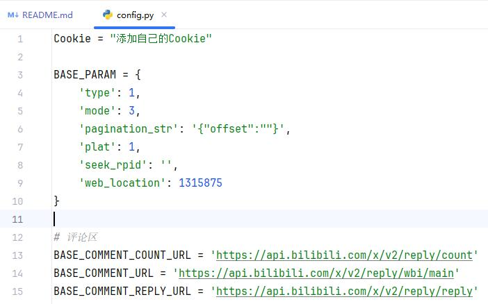

# bilibili信息获取


## 前言
该项目只做教学和个人使用，禁止用于商业用途。Cookie需要登陆后获取，然后填写到下图处。



## 评论模块
```python
# 测试获取评论数(经过我仔细一个一个评论数，我发现它给出的评论数和真实评论数不一致)
oid = '115463233279925' # 任何视频的oid
response = get_comment_count(oid)
print(response.json())

# 测试获取一级评论
oid = '115463233279925' # 任何视频的oid
comments = get_root_comment(oid)
with open('comments.json', 'w', encoding='utf-8') as f:
    json.dump(comments, f, ensure_ascii = False, indent = 4)

# 测试获取所有评论(一级评论 + 二级评论)
oid = '115463233279925'
comments = get_all_comments(oid)
with open('comments.json', 'w', encoding='utf-8') as f:
    json.dump(comments, f, ensure_ascii = False, indent = 4)
```